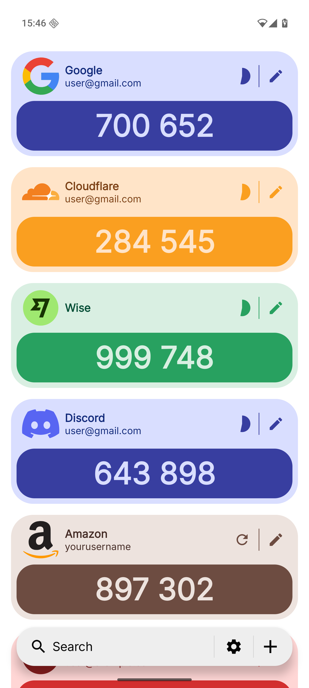
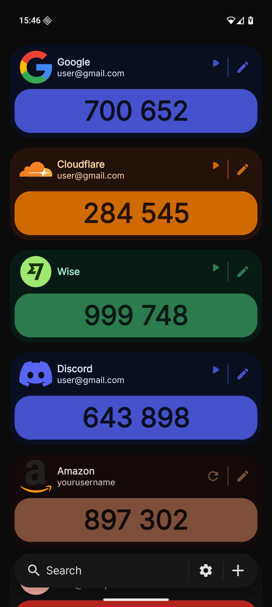

#  2fa

2fa by 979 is a free, open-source one-time password (OTP) manager published under the European Union Public License (EUPL). Designed for privacy and anonymity, it contains no networking code, uses minimal dependencies, and collects no telemetry - everything stays on your device. Development is community-driven and fully auditable. The app is primarily developed and tested on Google Pixel devices, and remains compatible with other Android phones, such as Samsung models.

## Features
### Time-based One-Time Password (TOTP)
- Configurable intervals starting at 10 seconds
- Supports 4–10 digit codes
- Hash algorithms: SHA-1, SHA-256, SHA-512

### HMAC-based One-Time Password (HOTP)
- Supports 4–10 digit codes
- Hash algorithms: SHA-1, SHA-256, SHA-512

### Backup & Restore 2FA Codes
- External storage (user-chosen location: SD card, USB drive, or Files)
- Password-protected using Argon2id
- Encrypted and authenticated with ChaCha20-Poly1305

### Export to Google Authenticator
- Migration via QR code for easy device transfer

### Honorable mentions
- Works without Google Play Services

## Installation

- **Google Play Store (Internal Testing):** To join the internal testing track on Google Play, send your Play Store email via **DM on [Discord](https://discord.com/invite/zxgXNzhYJu)**.
- **Direct APK:** Download the latest release from [Releases](https://github.com/979st/2fa-android/releases) and verify it using [AppVerifier](https://github.com/soupslurpr/AppVerifier) or Android's official apksigner tool.

## Development Roadmap
- ~**Alpha:** Add essential features~
- **Beta:** Integrate user feedback, refine the UI, improve usability, add animations, and publish on [Accrescent](https://accrescent.app/)
- **Release Candidate:** Prepare for a full launch on the Google Play Store

## Verifying APKs
All official release APKs are signed with our release key. Signing certificate fingerprints:

- **SHA-256:** `e5b28ea1e051c232dea94c27c0592e2c002d17c5ca81788b51306d608afe52c5`
- **SHA-1:** `4cb3772c2db89e65fbe5fa23ba33e3eee9b43421`
- **MD5:** `98d63ad9da56d57892207e53c7c13ea1`

We recommend verifying downloads using either [AppVerifier](https://github.com/soupslurpr/AppVerifier) or Android's official apksigner tool.

## 2fa Beta 1 Demo
| Light | Dark |
|---:|:---|
|  |  |
