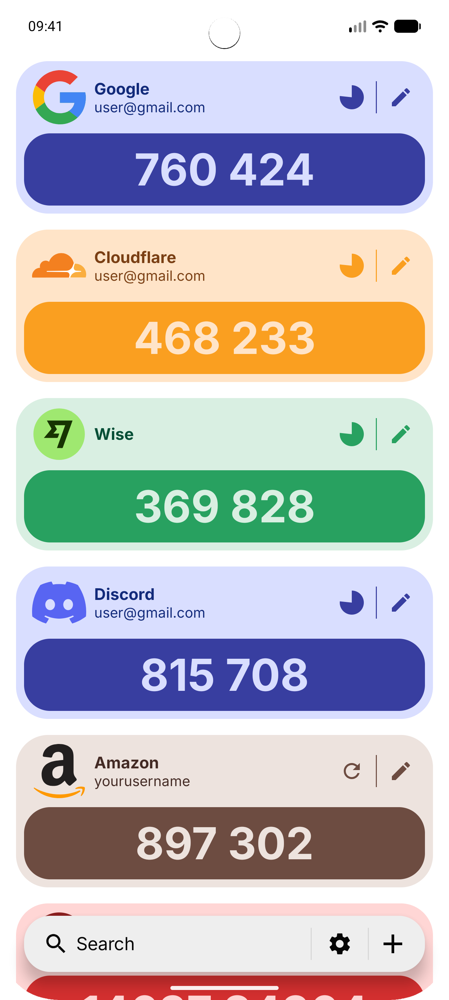
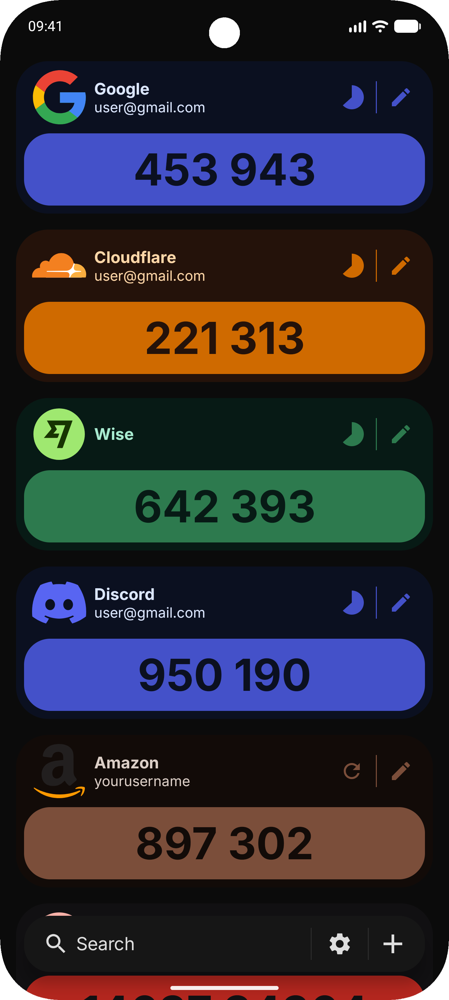
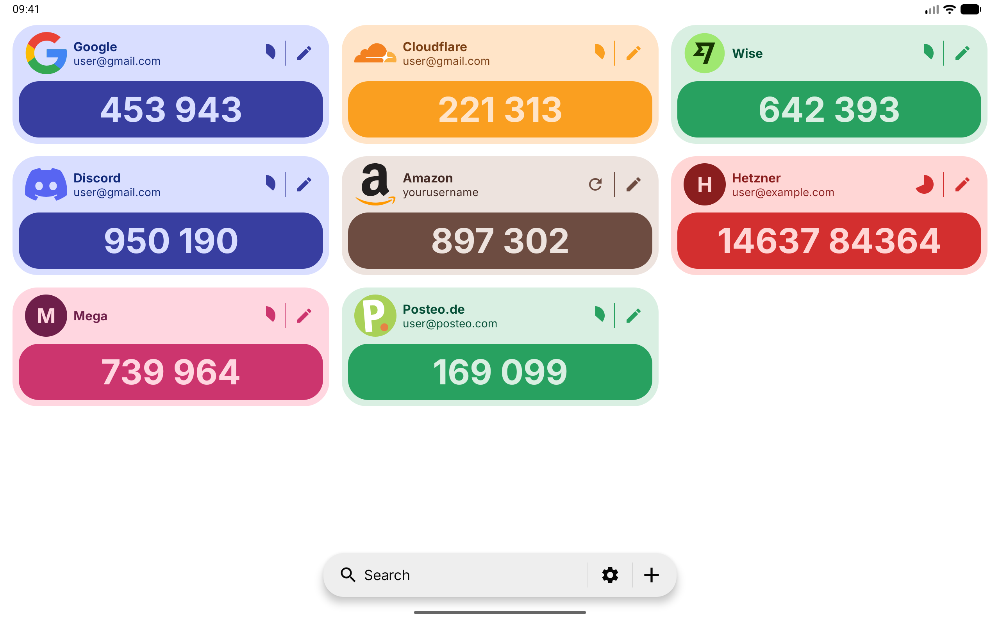

  

<h1 align="center">2fa</h1>
<h4 align="center">Manage one-time passwords securely, offline and without tracking</h4>

    
    
    
    

    
    

    

    
    
    

## Features
### Time-based One-Time Password (TOTP)
- Customizable refresh intervals starting at 10 seconds  
- Supports 4–10 digit codes  
- Hash algorithms: SHA-1, SHA-256, SHA-512  

### HMAC-based One-Time Password (HOTP)
- Supports 4–10 digit codes  
- Hash algorithms: SHA-1, SHA-256, SHA-512  

### Secure Vault
- All 2fa secrets are stored locally on the device  
- Encrypted and authenticated using AES-GCM
- Encryption keys are stored in the Android Keystore, with StrongBox hardware protection when supported  
- No cloud or external servers involved

### Backup & Restore 2FA Codes
- Create encrypted backups to external storage (SD card, USB drive, or Files)  
- Protected with a password using Argon2id for key derivation  
- Backups are encrypted and authenticated with ChaCha20-Poly1305

### Export to Google Authenticator
- Transfer accounts easily using QR code migration  

### Honorable mentions
- Works fully without Google Play Services

## Verifying APKs
All official release APKs are signed with our release key. Signing certificate fingerprints:

- SHA-256: `e5b28ea1e051c232dea94c27c0592e2c002d17c5ca81788b51306d608afe52c5`
- SHA-256 (AppVerifier): `E5:B2:8E:A1:E0:51:C2:32:DE:A9:4C:27:C0:59:2E:2C:00:2D:17:C5:CA:81:78:8B:51:30:6D:60:8A:FE:52:C5`

We recommend verifying downloads using either [AppVerifier](https://github.com/soupslurpr/AppVerifier) or Android's official apksigner tool.

## Development Roadmap
- ~~Alpha: Add essential features~~
- Beta: Refine the user interface, improve usability, add animations, integrate user feedback, ~~and publish on [Accrescent](https://accrescent.app/)~~
- Release Candidate: Prepare for a full launch on the Google Play Store

## License

This project is licensed under the [European Union Public License (EUPL)](https://joinup.ec.europa.eu/collection/eupl/eupl-text-eupl-12) -  see the LICENSE file for details.